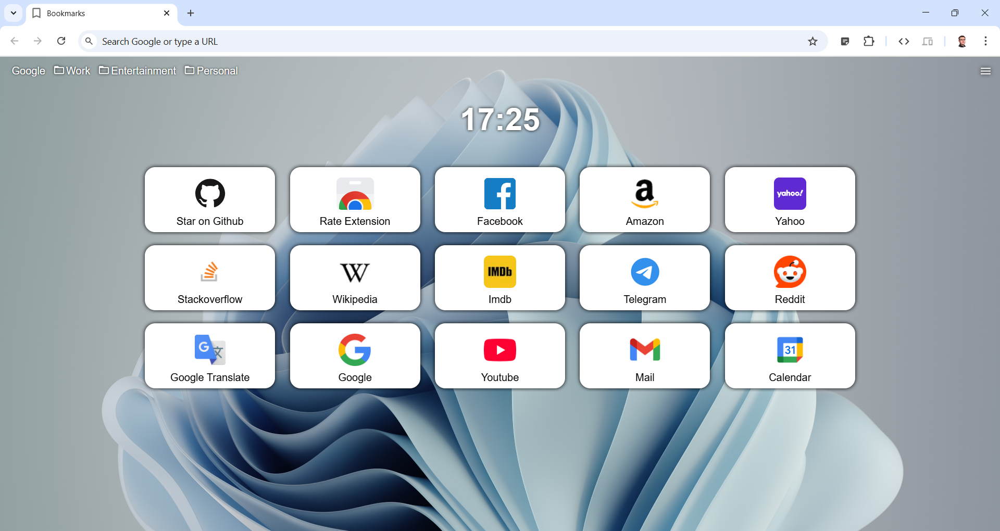

# Pulchra bookmarks - Chrome extention (1.0.0)

### Install from this repo
* Click on and download zip-file 
* Unzip in any place
* Go to chrome extentions: `chrome://extensions/`
* Turn on developer mode: 
* Install extention 
* That's all. Enjoy!

### Screenshot:

### TODO:
* GUI:
  * [x] Rounded corner bookmarks
  * [x] Quick access to Downloads, Bookmarks, History, Settings
  * [x] Sites logos
  * [x] Custom background
  * [x] Add bookmarks windows with preview
  * [ ] Wingows 11 style
  * [ ] Workspaces

* Behaviour:
  * [x] Turn on/off top bookmarks panel
  * [x] Where to open
  * [x] Context actions:
    * [x] Open in new tab
    * [x] Edit
    * [x] Delete
  * [x] Change bookmarks grid
  * [x] Import/export bookmarks file
  * [x] Hotkey open
  * [ ] Hotkey independed layout
  * [ ] Focus on page while open
  * [ ] Vertical centring grid
  * [x] Enter to save edit

* Back:
  * [x] Full open source
  * [x] No trace or advertisement
  * [ ] Translations
  * [x] Icon caching
  * [ ] Zero errors

* Future features:
  * [ ] Group bookmarks
  * [ ] Ctrl + F for found
  * [ ] Ctrl + Z revert last action
  * [x] Clock
  * [ ] Weather
