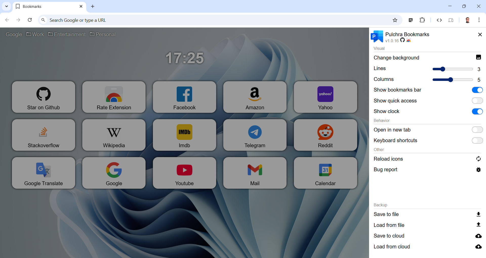

#  Pulchra Bookmarks - Chrome extention

### Install from [Chrome Web Store](https://chrome.google.com/webstore/detail/pulchra-bookmarks/pknkgclggganidoalifaagfjikhcdolb)

### Install from this repo
* Click on  and download zip-file 
* Unzip in any place
* Go to chrome extentions: `chrome://extensions/`
* Turn on developer mode: 
* Install extention 
* That's all. Enjoy!

### Screenshots:

